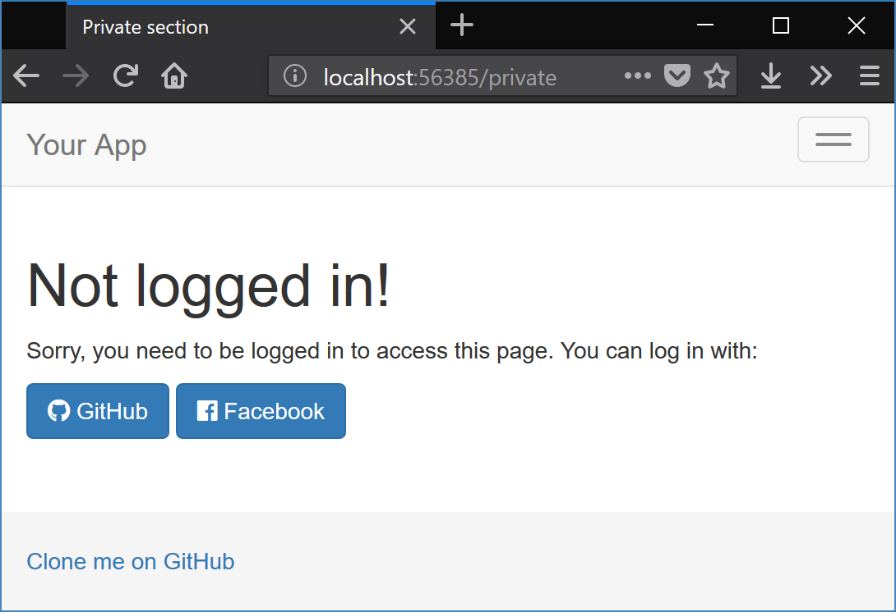
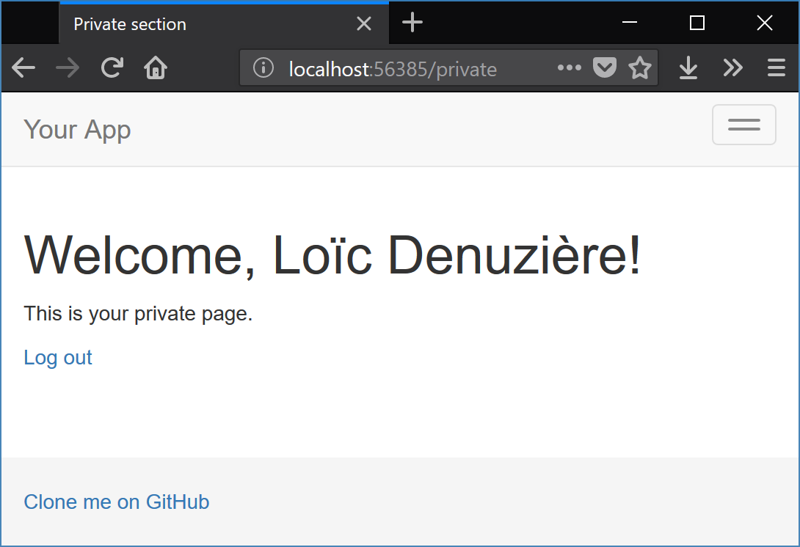
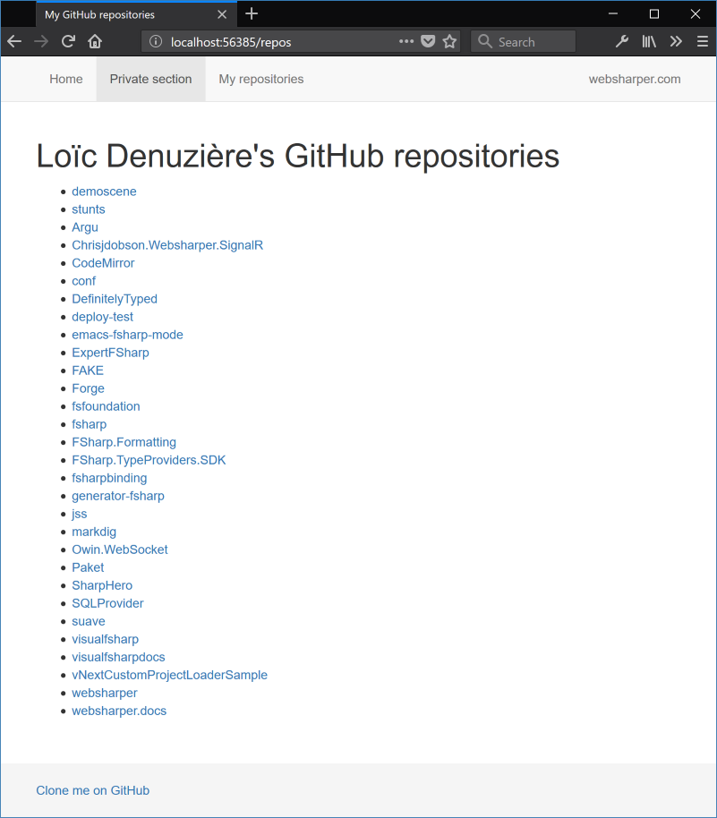

# WebSharper OAuth2 Sample

[](https://azuredeploy.net/)

This sample application shows how to provide "Log in with..." functionality to a [WebSharper](https://websharper.com) website using OAuth2. You can see it running [here](http://websharperoauthexample.azurewebsites.net/).





* [Building](#building)
* [Configuration](#config)
* [Code walkthrough](#walkthrough)
* [Extending the app](#extending)

<a name="building"/>
## Building

This project can be readily opened and built with Visual Studio.

<a name="config"/>
## Configuration

To run this application, you need to set it up with the OAuth providers it uses: GitHub and Facebook. First you need to create an application on these services' websites, then you need to configure this application with the credentials they provide.

### Creating the GitHub application

* Go to the OAuth application creation page in [your GitHub developer settings](https://github.com/settings/applications/new).

* Choose an application name, a homepage URL and a description.

* The authorization callback URL must be `http://<this-app>/oauth/GitHub`.  
  For example, for a local test from Visual Studio, this will be `http://localhost:56385/oauth/GitHub`.

* Click "Register application". You will be sent to a page where you can retrieve your application's credentials ("Client ID" and "Client Secret").

### Creating the Facebook application

* Go to [your Facebook developer page](https://developers.facebook.com/), then in the top-right menu "My Apps", choose "Add a New App".

* Choose a display name and a contact email, then Create App ID.

* You are sent to your new app's "Add Product" page; select Facebook Login > Set Up.

* You can go through the Quickstart wizard, or if you want to set up the bare necessary, you can select Facebook Login > Settings in the left menu, enter the authorization callback URL under "Valid OAuth redirect URIs" and Save Changes.

* The authorization callback URL must be `http://<this-app>/oauth/Facebook`.  
  For example, for a local test from Visual Studio, this will be `http://localhost:56385/oauth/Facebook`.

* Your credentials are available under Settings: "App ID" and "App Secret".

### Setting the credentials in the app

The app retrieves the credentials from standard AppSettings configuration. Since they are sensitive information, you should not put them directly in Web.config, and in any case, you should NOT commit them to source control!

The first solution is to create a file called `appSettings.config` in the `OAuthExample` folder and fill it with the following:

```xml
<?xml version="1.0" encoding="utf-8"?>
<appSettings>
  <add key="github-app-id" value="FIXME" />
  <add key="github-app-secret" value="FIXME" />
  <add key="facebook-app-id" value="FIXME" />
  <add key="facebook-app-secret" value="FIXME" />
</appSettings>
```

If you deploy your application to Azure, then there is an alternative possibility. In the [Azure portal](https://portal.azure.com), you can add Application Settings to your deployment.


<a name="walkthrough"/>
# Code Walkthrough

The code is structured as follows:

* [EndPoint.fs](OAuthExample/EndPoint.fs) defines the endpoint type, ie the list of different pages served by the app. There are four of them:
  * `Home` is the landing page.
  * `Private` is the restricted section: when a user is not logged in, it prompts them to log in with GitHub or Facebook, otherwise it shows their personal information retrieved from there.
  * `OAuth` is the authorization callback URL. It is the page to which the service provider redirects users after a successful or failed login; it processes information from the provider and logs the user in accordingly.
  * `Logout` logs the user out and redirects them to `Home`.

* [Database.fs](OAuthExample/Database.fs) contains a mock in-memory implementation of a database. It stores users' permanent data (username for this app, username for the service provider, and full name retrieved from the service provider) and session data (OAuth token).

* [Auth.fs](OAuthExample/Auth.fs) contains the authentication code proper. It defines the processing code for the `OAuth` endpoint.

    The core of this file is the `Provider` values in the `GitHub` and `Facebook` submodules. These providers declare everything needed for OAuth to work:
    * The app's OAuth credentials `service` of type `OAuth2.ServiceSettings`;
    * The URL to which the user must be redirected on login or rejection `redirectEndpointAction`;
    * The content to serve when this happens `redirectEndpoint`.

    Let's look closer at this content. `redirectEndpoint` checks whether the response is successful, ie if the user accepted to give our app access to their account. If so, then we have a `token` which we can use to query the service's API.
    
    We immediately use this token to query the API for the user's display name (`getUserData`), save this information to the database (`Database.AddOrUpdateUser`), and log the user into our app (`ctx.UserSession.LoginUser`).
    
    The actual query to the service's API to retrieve the user's id and display name is `JsonRequest`. It is a standard `System.Net.HttpWebRequest`, which we authorize using `token.AuthorizeRequest`. Note also the use of `WebSharper.Json` to parse the response body.
    
    The final important part of this file is the `Sitelet` value. Each provider creates a mini-sitelet that serves only the authorization callback for its service. `Sitelet` creates a larger sitelet that serves all of them; and it will itself be included into our full application in `Main.fs`.

* [Main.fs](OAuthExample/Main.fs) defines the content of the pages served by the app.

    All the pages of the site are grouped in the value `Main`, of type `Sitelet<EndPoint>`. It groups together two sitelets: `Auth.Sitelet` from above, which provides the authorization callbacks, and a call to `Application.MultiPage` which defines our site proper.
    
    Each page of the site is defined by a function of the `Site` module: `HomePage`, `PrivatePage` and `LogoutPage`. These use WebSharper.UI's templating type provider to serve content from `Main.html`.

    `PrivatePage` is of particular interest. First, it uses `ctx.UserSession.GetLoggedInUser()` to check whether the user is logged in and determine what content to serve. When they aren't, it needs to show links to log in using GitHub or Facebook. The URL is given by the corresponding `Provider.GetAuthorizationRequestUrl(ctx)`.

<a name="extending"/>
# Extending the app

To get a better grasp on it all, let's add a page to this website. This page will retrieve and show a list of the user's repositories if they are logged in with GitHub, or a small error message if they are logged in with Facebook or not logged in.

First, let's add an endpoint for this page in `EndPoint.fs`:

```fsharp
type EndPoint =
    | [<EndPoint "GET /">] Home
    | [<EndPoint "GET /private">] Private
    | [<EndPoint "GET /repos">] Repos // <- new
    | [<EndPoint "GET /oauth">] OAuth of provider: OAuthProvider
    | [<EndPoint "GET /logout">] Logout
```

Then, let's create a page for it in `Main.fs`:

```fsharp
    let ReposPage (ctx: Context<EndPoint>) = async {
        let! loggedIn = ctx.UserSession.GetLoggedInUser()
        let! body = async {
            match loggedIn |> Option.bind Database.TryGetUser with
            | Some user ->
                // If we are logged in...
                match user.OAuthUserId with
                | OAuthProvider.GitHub, githubUserId ->
                    // ... with GitHub, then get the repositories and display them.
                    let! repositories = Repositories.GetUserRepositories user.OAuthToken
                    return Doc.Concat [
                        h1 [] [text (user.DisplayName + "'s GitHub repositories")]
                        ul [] [
                            repositories
                            |> Array.map (fun repo ->
                                li [] [
                                    a [attr.href (sprintf "https://github.com/%s/%s" githubUserId repo.html_url)] [text repo.name]
                                ] :> Doc
                            )
                            |> Doc.Concat
                        ]
                    ]
                | _ ->
                    // ... with Facebook, then show an error message.
                    return p [] [text "You must be logged in with GitHub to see this content."] :> Doc
            | None ->
                // If we are not logged in, then show an error message.
                return NotLoggedInErrorMessage ctx
        }
        return! Templating.Main ctx EndPoint.Private "My GitHub repositories" [body]
    }
```

Note that here, unlike in `PrivatePage`, the value of `body` is retrieved asynchronously: we need to query the GitHub API to retrieve the list of repositories.

This query is done by the function `Repositories.GetUserRepositories`, which we are going to write now. We are adding new back-end functionality, which should be logically separated from the display. So let's add a file for it: `Repositories.fs`. It needs to be placed after `Auth.fs` (because it will need to call `JsonRequest`) and before `Main.fs` (because it will be called from there).

The GitHub documentation on how to retrieve user repositories is located [here](https://developer.github.com/v3/repos/#list-your-repositories). The URL to request is `https://api.github.com/user/repos`, and the response is a JSON array of objects with many fields; the ones we are interested in are `name` (the repo's display name) and `html_url` (the repo's home page). So we can simply retrieve it as follows:

```fsharp
namespace OAuthExample

module Repositories =

    type Repository = { name: string; html_url: string }

    let GetUserRepositories token =
        Auth.JsonRequest<Repository[]> "https://api.github.com/user/repos" token
```

All that remains now is to add our newly created page to the sitelet in `Main.fs`:

```fsharp
    [<Website>]
    let Main =
        Auth.Sitelet
        <|>
        Application.MultiPage (fun ctx endpoint ->
            match endpoint with
            | EndPoint.Home -> HomePage ctx
            | EndPoint.Private -> PrivatePage ctx
            | EndPoint.Logout -> LogoutPage ctx
            | EndPoint.Repos -> ReposPage ctx // <- new
            // This is already handled by Auth.Sitelet above:
            | EndPoint.OAuth _ -> Content.ServerError
        )
```

We can compile our app and visit `http://localhost:56385/repos`.

One final touch is to add a link to our new fancy page to the top menu (`Main.fs`):

```fsharp
    let MenuBar (ctx: Context<EndPoint>) endpoint : Doc list =
        let ( => ) txt act =
             li [if endpoint = act then yield attr.``class`` "active"] [
                a [attr.href (ctx.Link act)] [text txt]
             ]
        [
            "Home" => EndPoint.Home
            "Private section" => EndPoint.Private
            "My repositories" => EndPoint.Repos // <- new
        ]
```

And we are good to go!



The full source for this extended app is available [on the `repos` branch of this project](https://github.com/dotnet-websharper/oauth-app/tree/repos).
