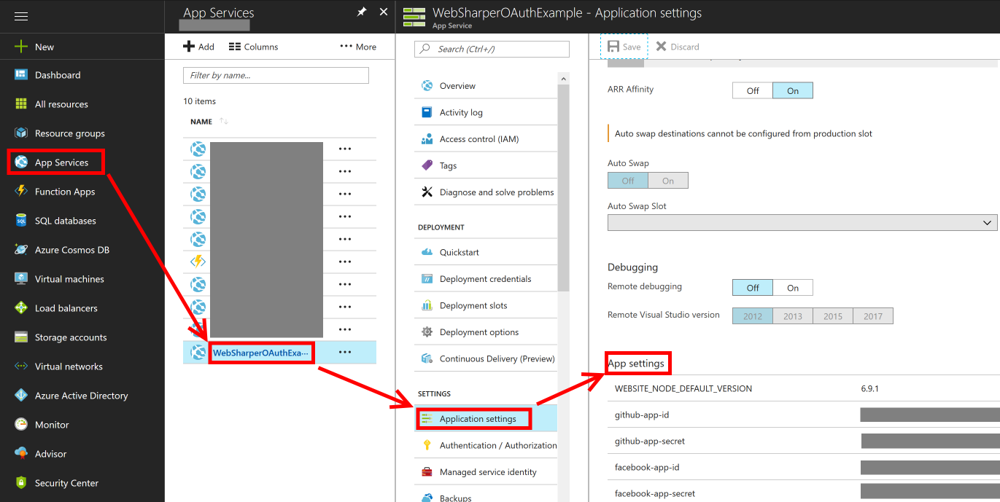

# WebSharper OAuth2 Sample

[](https://azuredeploy.net/)

This sample application shows how to provide "Log in with..." functionality to a [WebSharper](https://websharper.com) website using OAuth2.


## Building

This project can be readily opened and built with Visual Studio.

## Configuration

To run this application, you need to set it up with the OAuth providers it uses: GitHub and Facebook. First you need to create an application on these services' websites, then you need to configure this application with the credentials they provide.

### Creating the GitHub application

* Go to the OAuth application creation page in [your GitHub developer settings](https://github.com/settings/applications/new).

* Choose an application name, a homepage URL and a description.

* The authorization callback URL must be `http://<this-app>/oauth/GitHub`.  
  For example, for a local test from Visual Studio, this will be `http://localhost:56385/oauth/GitHub`.

* Click "Register application". You will be sent to a page where you can retrieve your application's credentials ("Client ID" and "Client Secret").

### Creating the Facebook application

* Go to [your Facebook developer page](https://developers.facebook.com/), then in the top-right menu "My Apps", choose "Add a New App".

* Choose a display name and a contact email, then Create App ID.

* You are sent to your new app's "Add Product" page; select Facebook Login > Set Up.

* You can go through the Quickstart wizard, or if you want to set up the bare necessary, you can select Facebook Login > Settings in the left menu, enter the authorization callback URL under "Valid OAuth redirect URIs" and Save Changes.

* The authorization callback URL must be `http://<this-app>/oauth/Facebook`.  
  For example, for a local test from Visual Studio, this will be `http://localhost:56385/oauth/Facebook`.

* Your credentials are available under Settings: "App ID" and "App Secret".

### Setting the credentials in the app

The app retrieves the credentials from standard AppSettings configuration. Since they are sensitive information, you should not put them directly in Web.config, and in any case, you should NOT commit them to source control!

The first solution is to create a file called `appSettings.config` in the `OAuthExample` folder and fill it with the following:

```xml
<?xml version="1.0" encoding="utf-8"?>
<appSettings>
  <add key="github-app-id" value="FIXME" />
  <add key="github-app-secret" value="FIXME" />
  <add key="facebook-app-id" value="FIXME" />
  <add key="facebook-app-secret" value="FIXME" />
</appSettings>
```

If you deploy your application to Azure, then there is an alternative possibility. In the [Azure portal](https://portal.azure.com), you can add Application Settings to your deployment.


